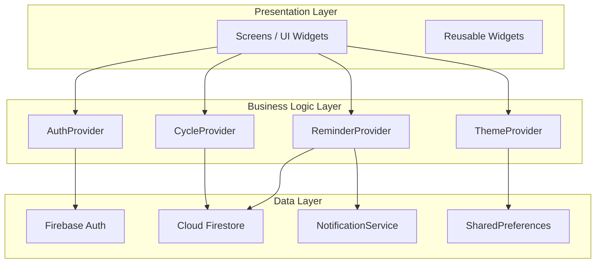
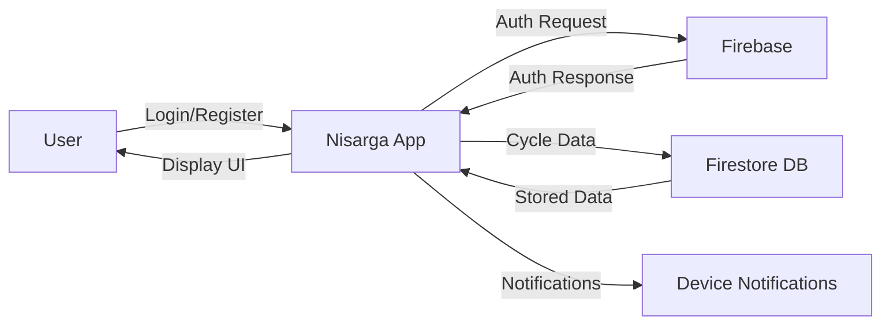
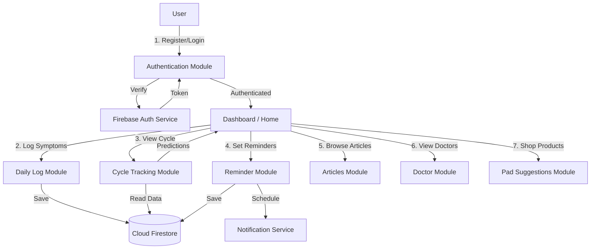
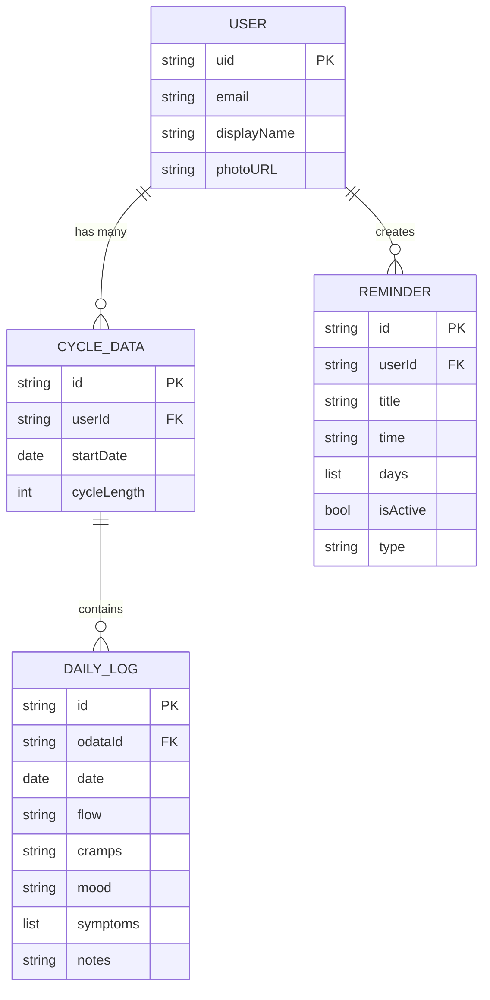
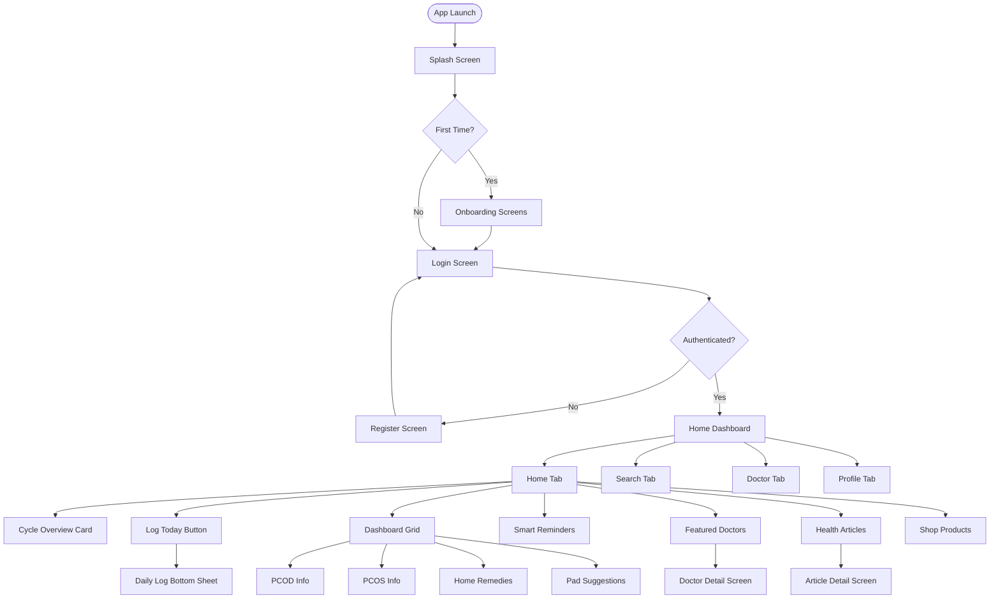
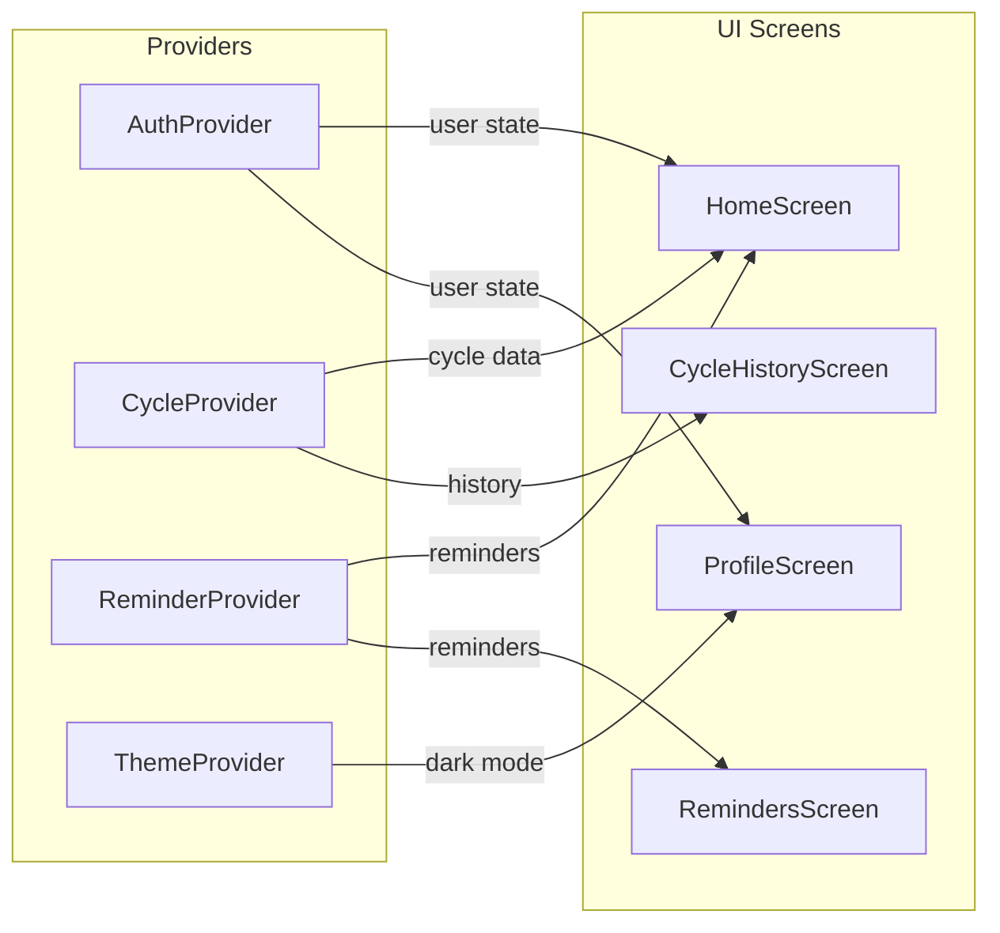

# Nisarga - Menstrual Health & Cycle Tracking App
## BCA Final Year Project Report

---

## Table of Contents
1. [Introduction](#1-introduction)
2. [Problem Statement](#2-problem-statement)
3. [Objectives](#3-objectives)
4. [Technology Stack](#4-technology-stack)
5. [System Requirements](#5-system-requirements)
6. [System Architecture](#6-system-architecture)
7. [Data Flow Diagram (DFD)](#7-data-flow-diagram)
8. [ER Diagram](#8-er-diagram)
9. [Application Flow](#9-application-flow)
10. [Module Description](#10-module-description)
11. [Screen Designs](#11-screen-designs)
12. [Directory Structure](#12-directory-structure)
13. [Data Models](#13-data-models)
14. [State Management](#14-state-management)
15. [Database Design](#15-database-design)
16. [Testing & Deployment](#16-testing--deployment)
17. [Future Enhancements](#17-future-enhancements)
18. [Conclusion](#18-conclusion)
19. [References](#19-references)

---

## 1. Introduction

**Nisarga** is a cross-platform mobile application designed to empower women by providing comprehensive menstrual health management tools. Built using Flutter and Firebase, the app allows users to track their menstrual cycles, log daily symptoms, set smart reminders, browse health articles, consult featured doctors, and shop for menstrual hygiene products — all within a single, beautifully designed interface.

The name "Nisarga" is derived from Sanskrit, meaning "Nature" — reflecting the app's philosophy of treating menstrual health as a natural and essential part of well-being.

---

## 2. Problem Statement

Menstrual health is often overlooked and stigmatized in many communities. Women frequently lack access to:
- Reliable cycle prediction tools
- Accurate health education about PCOD/PCOS
- A centralized platform for doctor consultation
- Reminders for medication or cycle-related events

**Nisarga** aims to solve these problems by providing an all-in-one mobile solution that is private, educational, and easy to use.

---

## 3. Objectives

1. To develop a user-friendly mobile application for menstrual cycle tracking.
2. To provide educational content on menstrual health, PCOD, PCOS, and home remedies.
3. To implement smart reminders for medication, hydration, and appointments.
4. To integrate a doctor directory for easy consultation access.
5. To offer a curated shop for menstrual hygiene products.
6. To ensure data privacy through Firebase Authentication.
7. To support both Light and Dark mode themes for user comfort.

---

## 4. Technology Stack

| Layer | Technology | Purpose |
|-------|-----------|---------|
| **Frontend Framework** | Flutter 3.x | Cross-platform UI development |
| **Programming Language** | Dart | Application logic |
| **State Management** | Provider (ChangeNotifier) | Reactive state management |
| **Routing** | GoRouter 14.x | Declarative navigation |
| **Backend** | Firebase | Cloud infrastructure |
| **Authentication** | Firebase Auth | Email/password login |
| **Database** | Cloud Firestore | NoSQL document database |
| **Local Notifications** | flutter_local_notifications | Smart reminders |
| **Charts** | fl_chart | Cycle history visualization |
| **Local Storage** | SharedPreferences | Theme & onboarding state |
| **URL Launcher** | url_launcher | External links (Buy Now) |
| **Date Formatting** | intl | Date/time formatting |
| **IDE** | VS Code / Android Studio | Development environment |
| **Version Control** | Git | Source code management |
| **Build Target** | Android APK | Production deployment |

### Key Dependencies (pubspec.yaml)
```yaml
dependencies:
  flutter: sdk
  provider: ^6.1.2
  go_router: ^14.0.0
  firebase_core: ^3.0.0
  firebase_auth: ^5.0.0
  cloud_firestore: ^5.0.0
  fl_chart: ^0.69.0
  flutter_local_notifications: ^18.0.0
  shared_preferences: ^2.3.0
  intl: ^0.19.0
  url_launcher: ^6.3.0
```

---

## 5. System Requirements

### Hardware Requirements
| Component | Minimum |
|-----------|---------|
| Processor | Intel i3 / AMD equivalent |
| RAM | 4 GB |
| Storage | 2 GB free space |
| Android Device | Android 5.0 (API 21) or above |

### Software Requirements
| Software | Version |
|----------|---------|
| Operating System | Windows 10/11, macOS, Linux |
| Flutter SDK | 3.0.0 or higher |
| Dart SDK | 3.0.0 or higher |
| Android Studio | Latest stable |
| VS Code | Latest stable |
| Chrome / Edge | For web debugging |

---

## 6. System Architecture

The application follows a **layered architecture** pattern separating concerns into Presentation, Business Logic, and Data layers.



### Architecture Pattern: Provider + MVVM-Inspired

```
┌─────────────────────────────────────────────┐
│                   VIEW                       │
│   (Screens: Home, Doctor, Articles, etc.)   │
│         Consumes state via Consumer<>        │
├─────────────────────────────────────────────┤
│              VIEW MODEL (Providers)          │
│   AuthProvider | CycleProvider |             │
│   ReminderProvider | ThemeProvider            │
│         Extends ChangeNotifier               │
├─────────────────────────────────────────────┤
│                  MODEL                       │
│   CycleData | DailyLog | Reminder |         │
│   Doctor | Article | Product                 │
│         Plain Dart classes                   │
├─────────────────────────────────────────────┤
│              SERVICES / DATA                 │
│   Firebase Auth | Cloud Firestore |          │
│   NotificationService | SharedPreferences    │
└─────────────────────────────────────────────┘
```

---

## 7. Data Flow Diagram

### Level 0 - Context Diagram



### Level 1 - Detailed DFD



---

## 8. ER Diagram



---

## 9. Application Flow

### User Flow Diagram



---

## 10. Module Description

### Module 1: Authentication
- **Screens**: Login, Register
- **Features**: Email/password sign-up and sign-in via Firebase Auth
- **Provider**: `AuthProvider` manages user session state

### Module 2: Onboarding
- **Screen**: OnboardingScreen with multi-page carousel
- **Features**: Welcome pages introducing app features to first-time users

### Module 3: Home Dashboard
- **Screen**: HomeScreen (inside MainScreen with BottomNavigationBar)
- **Features**:
  - Personalized greeting with time-based message
  - Cycle overview card with current day and predictions
  - Today's symptom summary (flow, cramps, mood)
  - Quick log button with bottom sheet
  - Dashboard grid (PCOD, PCOS, Remedies, Pads)
  - Smart reminders summary
  - Featured doctors (horizontal scroll)
  - Health articles (horizontal scroll)
  - Shop menstrual products section

### Module 4: Cycle Tracking
- **Screens**: CycleHistoryScreen
- **Features**: View past cycle records, cycle length trends using fl_chart
- **Provider**: `CycleProvider` handles predictions and data persistence

### Module 5: Daily Symptom Logging
- **Widget**: DailyLogSheet (BottomSheet)
- **Features**: Log flow intensity, cramps severity, mood, and custom symptoms
- **Model**: `DailyLog` with date, flow, cramps, mood, symptoms, and notes

### Module 6: Smart Reminders
- **Screen**: RemindersScreen
- **Features**: Create, toggle, and delete reminders for medication, hydration, etc.
- **Service**: `NotificationService` using flutter_local_notifications

### Module 7: Health Education
- **Screens**: ArticlesScreen, ArticleDetailScreen, PcodScreen, PcosScreen, HomeRemediesScreen, MedicinesScreen
- **Features**: Curated articles with full content, PCOD/PCOS educational content

### Module 8: Doctor Consultation
- **Screens**: DoctorScreen (list), DoctorDetailScreen
- **Features**: Browse doctors by specialization, view ratings, fees, availability

### Module 9: Product Shop
- **Screen**: PadSuggestionsScreen
- **Features**: Browse pads, cups, tampons by category with ratings, prices, and Buy Now

### Module 10: Search
- **Screen**: SearchScreen
- **Features**: Search across doctors, articles, and features

### Module 11: Profile & Settings
- **Screen**: ProfileScreen
- **Features**: View user info, toggle dark/light theme, sign out

---

## 11. Screen Designs

| # | Screen Name | Route | Description |
|---|------------|-------|-------------|
| 1 | Onboarding | `/onboarding` | Welcome carousel for first-time users |
| 2 | Login | `/login` | Email/password sign-in |
| 3 | Register | `/register` | New account creation |
| 4 | Main Dashboard | `/` | Bottom nav with Home, Search, Doctor, Profile |
| 5 | PCOD Info | `/pcod` | Educational content about PCOD |
| 6 | PCOS Info | `/pcos` | Educational content about PCOS |
| 7 | Medicines | `/medicines` | Common medicines information |
| 8 | Pad Suggestions | `/pads` | Product shop with categories |
| 9 | Home Remedies | `/home-remedies` | Natural remedy suggestions |
| 10 | Articles List | `/articles` | All health articles with filters |
| 11 | Article Detail | `/article-detail` | Full article content view |
| 12 | Cycle History | `/cycle-history` | Past cycles and charts |
| 13 | Reminders | `/reminders` | Manage smart reminders |
| 14 | Doctors List | `/doctors` | All doctors listing |
| 15 | Doctor Detail | `/doctor/:id` | Individual doctor profile |

---

## 12. Directory Structure

```
nisarga/
├── android/                    # Android native configuration
│   └── app/
│       └── src/main/
│           └── AndroidManifest.xml
├── assets/
│   └── images/
│       ├── doctors/            # Doctor profile images
│       ├── articles/           # Article banner images
│       ├── logo.png            # App logo
│       └── banner.png          # Onboarding banner
├── lib/
│   ├── main.dart               # App entry point
│   ├── app.dart                # MaterialApp configuration
│   ├── firebase_options.dart   # Firebase config (auto-generated)
│   ├── core/
│   │   ├── constants/          # App-wide constants
│   │   ├── models/             # Data models (7 files)
│   │   │   ├── article.dart
│   │   │   ├── cycle_data.dart
│   │   │   ├── daily_log.dart
│   │   │   ├── doctor.dart
│   │   │   ├── medicine.dart
│   │   │   ├── product.dart
│   │   │   └── reminder.dart
│   │   ├── providers/          # State management (4 files)
│   │   │   ├── auth_provider.dart
│   │   │   ├── cycle_provider.dart
│   │   │   ├── reminder_provider.dart
│   │   │   └── theme_provider.dart
│   │   ├── routes/
│   │   │   └── app_router.dart # GoRouter configuration
│   │   ├── services/
│   │   │   └── notification_service.dart
│   │   └── theme/
│   │       ├── app_colors.dart
│   │       └── app_theme.dart
│   └── presentation/
│       ├── widgets/            # Reusable UI components
│       │   ├── daily_log_sheet.dart
│       │   └── gradient_header.dart
│       └── screens/            # All app screens (14 modules)
│           ├── articles/
│           ├── auth/
│           ├── cycle_history/
│           ├── doctor/
│           ├── home/
│           ├── home_remedies/
│           ├── main_screen.dart
│           ├── medicines/
│           ├── onboarding/
│           ├── pads/
│           ├── pcod/
│           ├── pcos/
│           ├── profile/
│           ├── reminders/
│           └── search/
├── pubspec.yaml                # Dependencies & assets
├── README.md                   # Setup & run instructions
└── .gitignore                  # Git exclusions
```

---

## 13. Data Models

### CycleData
| Field | Type | Description |
|-------|------|-------------|
| id | String | Unique identifier |
| userId | String | Firebase user UID |
| startDate | DateTime | Cycle start date |
| cycleLength | int | Length of cycle (default 28) |

### DailyLog
| Field | Type | Description |
|-------|------|-------------|
| id | String | Unique identifier |
| cycleDataId | String | Parent cycle reference |
| date | DateTime | Log date |
| flow | String | Flow intensity (light/medium/heavy) |
| cramps | String | Cramp severity |
| mood | String | Current mood |
| symptoms | List<String> | Additional symptoms |
| notes | String | Free-text notes |

### Reminder
| Field | Type | Description |
|-------|------|-------------|
| id | String | Unique identifier |
| userId | String | Firebase user UID |
| title | String | Reminder name |
| time | String | Scheduled time |
| days | List<String> | Active days of week |
| isActive | bool | Enabled/disabled toggle |
| type | String | Category (medication/hydration/etc.) |

---

## 14. State Management

Nisarga uses **Provider** with `ChangeNotifier` for reactive state management.



| Provider | Responsibility |
|----------|---------------|
| `AuthProvider` | Manages Firebase Auth user session (login, register, logout) |
| `CycleProvider` | Manages cycle data, daily logs, predictions, fertility insights |
| `ReminderProvider` | Manages reminders CRUD and notification scheduling |
| `ThemeProvider` | Manages light/dark mode toggle with SharedPreferences |

---

## 15. Database Design

### Firestore Collections

```
Firestore Root
├── users/
│   └── {userId}/
│       ├── displayName: "Rohan"
│       ├── email: "rohan@example.com"
│       └── ...
├── cycles/
│   └── {cycleId}/
│       ├── userId: "abc123"
│       ├── startDate: Timestamp
│       ├── cycleLength: 28
│       └── dailyLogs/
│           └── {logId}/
│               ├── date: Timestamp
│               ├── flow: "medium"
│               ├── cramps: "mild"
│               ├── mood: "happy"
│               └── symptoms: ["bloating", "fatigue"]
└── reminders/
    └── {reminderId}/
        ├── userId: "abc123"
        ├── title: "Take Iron Tablet"
        ├── time: "09:00 AM"
        ├── days: ["Mon", "Wed", "Fri"]
        ├── isActive: true
        └── type: "medication"
```

---

## 16. Testing & Deployment

### Testing
- **Manual Testing**: All screens tested on Android emulator and physical device
- **Release Build Testing**: APK installed on real Android devices to verify Firebase connectivity
- **Edge Cases Tested**:
  - No internet connection handling
  - Empty state UI (no logs, no reminders)
  - Firebase initialization failure (graceful fallback)

### Deployment
- **Build Command**: `flutter build apk --release`
- **Output**: `build/app/outputs/flutter-apk/app-release.apk` (58.5 MB)
- **Min Android SDK**: API 21 (Android 5.0 Lollipop)
- **App Name**: Nisarga
- **Theme Color**: Purple (#8E6CEF)

---

## 17. Future Enhancements

1. **AI-Powered Predictions**: Use machine learning to improve cycle predictions based on historical data.
2. **Doctor Chat Integration**: Real-time chat with doctors via Firebase Realtime Database.
3. **Wearable Integration**: Sync data from smartwatches for automatic symptom detection.
4. **Multi-language Support**: Add Hindi, Kannada, and other regional languages.
5. **Community Forum**: A safe space for women to discuss menstrual health topics.
6. **Period Product Delivery**: Integrate with e-commerce APIs for direct product ordering.
7. **iOS App Store Deployment**: Publish to Apple App Store.
8. **Google Play Store**: Publish to Google Play Store.

---

## 18. Conclusion

Nisarga is a comprehensive menstrual health companion designed with the philosophy that period tracking should be simple, educational, and empowering. By combining cycle tracking, health education, doctor access, and product shopping into one beautifully designed Flutter application backed by Firebase, Nisarga delivers a complete ecosystem for women's menstrual health management.

The project demonstrates practical application of modern mobile development practices including:
- Cross-platform development with Flutter
- Cloud-based authentication and database with Firebase
- Reactive state management with Provider
- Declarative routing with GoRouter
- Material Design 3 with dark/light theme support

---

## 19. References

1. Flutter Documentation - https://docs.flutter.dev/
2. Firebase Documentation - https://firebase.google.com/docs
3. Dart Language Tour - https://dart.dev/language
4. Provider Package - https://pub.dev/packages/provider
5. GoRouter Package - https://pub.dev/packages/go_router
6. Material Design 3 - https://m3.material.io/
7. WHO Menstrual Health Guidelines - https://www.who.int/
8. fl_chart Package - https://pub.dev/packages/fl_chart

---

*Report prepared for BCA Final Year Project Submission*
*Project: Nisarga - Menstrual Health & Cycle Tracking App*
*Technology: Flutter + Firebase*
