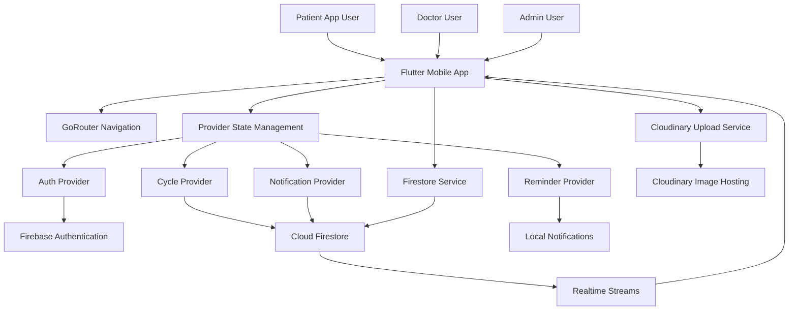
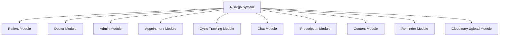
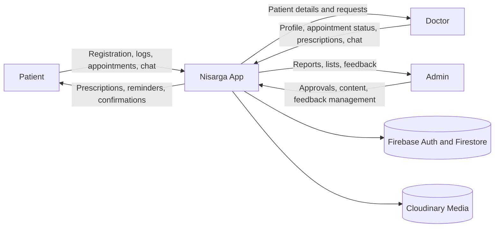
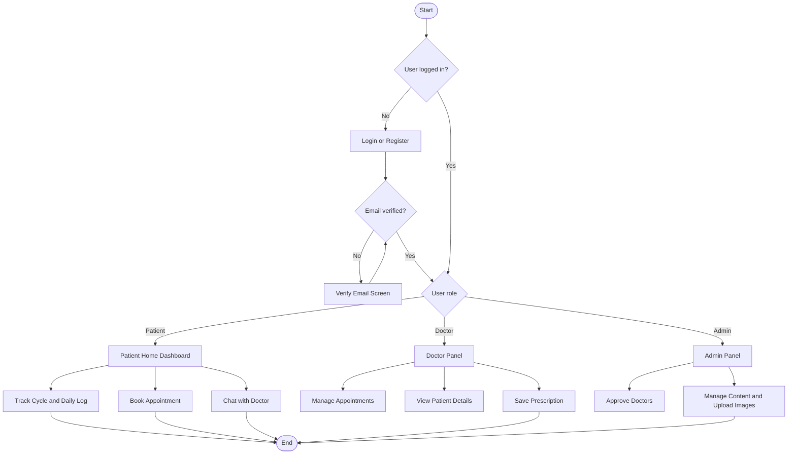
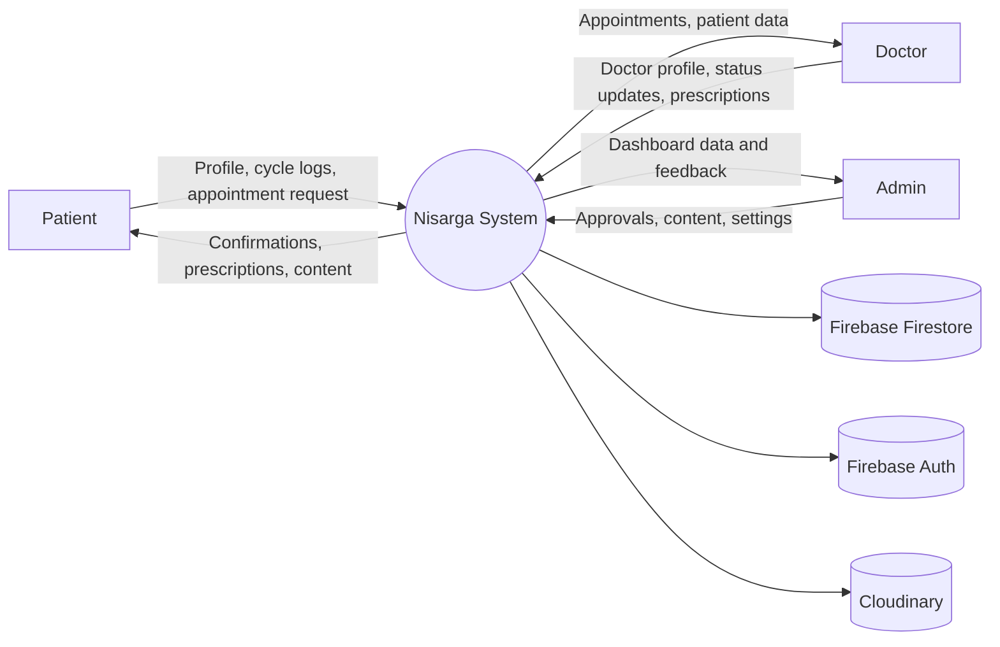
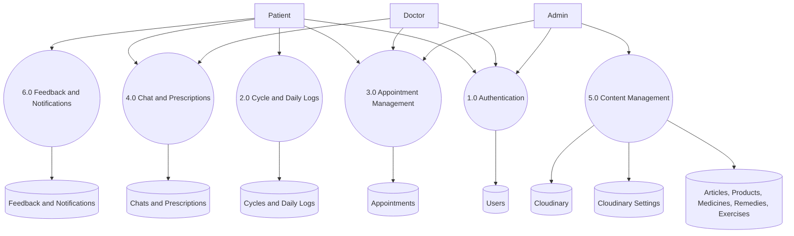
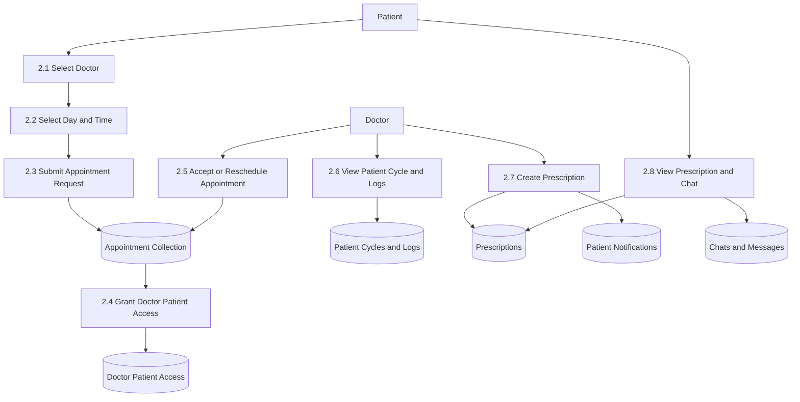
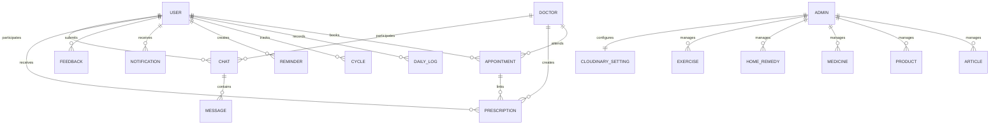
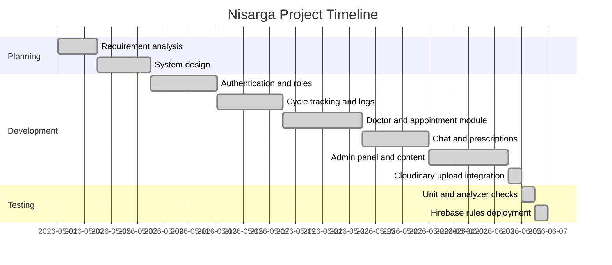

# Nisarga - Menstrual Health and Cycle Care App

## Project Title

Nisarga - Menstrual Health and Cycle Care Application

## Category

Healthcare Management System / Menstrual Health Tracking System

## Overview

Nisarga is a Flutter-based healthcare application designed to help users track menstrual cycles, log daily health symptoms, book doctor appointments, chat with approved doctors, view prescriptions, receive reminders, and access educational content related to menstrual health, PCOD, and PCOS.

The project uses Firebase Authentication and Cloud Firestore for real-time backend services. The admin panel manages users, doctors, appointments, content, exercises, feedback, and Cloudinary image upload settings. Cloudinary is used for free image uploads without Firebase Storage.

---

## Table of Contents

1. [Chapter 1 - Introduction](#chapter-1---introduction)
2. [Chapter 2 - Software Requirement Specification](#chapter-2---software-requirement-specification)
3. [Chapter 3 - System Design](#chapter-3---system-design)
4. [Chapter 4 - Database Design](#chapter-4---database-design)
5. [Chapter 5 - Detailed Design](#chapter-5---detailed-design)
6. [Chapter 6 - Program Code Listing](#chapter-6---program-code-listing)
7. [Chapter 7 - Screens and Outputs](#chapter-7---screens-and-outputs)
8. [Chapter 8 - Testing](#chapter-8---testing)
9. [Deployment Guide](#deployment-guide)
10. [Conclusion](#conclusion)
11. [Future Enhancements](#future-enhancements)
12. [Bibliography](#bibliography)

---

# Chapter 1 - Introduction

## 1.1 Introduction of the System

Menstrual health tracking requires accurate cycle records, daily symptom logs, health reminders, doctor support, and reliable health education. Manual tracking or scattered notes can lead to missed dates, incomplete health history, and poor communication with healthcare providers.

Nisarga provides a centralized digital system where users can manage menstrual cycle data, book consultations, chat with doctors, view prescriptions, and receive reminders. Doctors can manage appointments, view patient information with granted access, and create prescriptions. Admins can manage doctors, users, content, feedback, and Cloudinary media uploads.

## 1.2 Background

Traditional menstrual health management often depends on paper notes, memory, or separate messaging apps. These approaches create problems such as:

- Difficulty tracking cycle history.
- Missed reminders for health tasks.
- No centralized doctor-patient communication.
- No structured prescription history.
- Limited admin control over doctors and educational content.
- Manual content image handling.

Nisarga solves these issues by using real-time Firebase data, structured panels for each role, and Cloudinary-based content image uploads.

## 1.3 Objectives of the System

- Provide secure user, doctor, and admin access.
- Track menstrual cycles and daily symptoms.
- Support appointment booking with approved doctors.
- Enable real-time doctor-patient chat.
- Allow doctors to view patient details after appointment access is granted.
- Generate and store prescriptions.
- Provide admin-managed PCOD/PCOS exercises and health content.
- Store feedback and notification preferences.
- Use Cloudinary for image uploads without Firebase Storage.
- Keep all operational data real and realtime, with no mock data.

## 1.4 Scope of the System

The system is designed for:

- Patients / users tracking menstrual health.
- Doctors managing appointments and prescriptions.
- Admins managing the healthcare platform.

The system supports authentication, email verification, doctor approval, appointment management, daily logging, cycle history, prescriptions, chat, content management, exercises, feedback, reminders, notifications, language preference storage, and Cloudinary uploads.

## 1.5 Structure of the System

Main modules:

- User Management
- Doctor Management
- Appointment Management
- Cycle Tracking
- Daily Health Logging
- Prescription Management
- Realtime Chat
- Reminder and Notification Management
- PCOD/PCOS Content and Exercise Management
- Admin Dashboard
- Feedback Management
- Cloudinary Media Upload Management

## 1.6 System Architecture

Figure 1 - System Architecture Diagram



## 1.7 End Users

- Patients
- Doctors
- Administrators

## 1.8 Software Used

| Software / Tool | Purpose |
|---|---|
| Flutter | Cross-platform mobile application development |
| Dart | Application programming language |
| Firebase Authentication | Secure login, registration, and email verification |
| Cloud Firestore | Realtime database |
| Firebase CLI | Rules deployment |
| Cloudinary | Free image upload and hosting |
| Provider | State management |
| GoRouter | App routing |
| Flutter Local Notifications | On-device reminder notifications |
| Image Picker | Selecting content images from device |
| HTTP | Uploading selected images to Cloudinary |
| Android Studio / VS Code | Development environment |
| Git | Version control |

## 1.9 Hardware Requirements

| Hardware | Specification |
|---|---|
| Processor | Intel Core i3/i5 or higher |
| RAM | 4 GB or above |
| Hard Disk | 2 GB free space for source and dependencies |
| Mobile Device | Android phone or emulator |
| Internet | Required for Firebase and Cloudinary |

---

# Chapter 2 - Software Requirement Specification

## 2.1 Introduction

This Software Requirement Specification describes the functional and non-functional requirements of the Nisarga healthcare application.

## 2.2 Overall Description

### Product Perspective

Nisarga is a mobile-first healthcare platform. It connects patients, doctors, and administrators through a Firebase-backed real-time application.

### Product Functions

- User registration and login.
- Firebase email verification.
- Role-based access for patient, doctor, and admin.
- Doctor approval by admin.
- Cycle and daily symptom tracking.
- Appointment booking and status management.
- Doctor patient list based on appointment access.
- Realtime chat.
- Prescription creation and patient prescription view.
- Admin content management.
- PCOD/PCOS exercise management.
- Feedback submission and admin review.
- Cloudinary image uploads.

### User Characteristics

| User Type | Characteristics |
|---|---|
| Patient | Uses app for cycle care, logs, appointments, chat, prescriptions, and reminders |
| Doctor | Uses panel for appointments, patient details, chat, and prescriptions |
| Admin | Manages users, doctors, content, appointments, feedback, and media settings |

### Constraints

- Internet connection is required for Firebase and Cloudinary operations.
- Firebase Storage and Cloud Functions are not required in the free setup.
- Cloudinary uploads require a configured unsigned upload preset.
- Doctor data is visible to patients only after admin approval.

### Assumptions

- Users have access to an Android device or emulator.
- Firebase project is configured.
- Admin creates Cloudinary unsigned upload settings before uploading images.
- Healthcare data is entered accurately by users and doctors.

## 2.3 Functional Requirements

### Module 1 - User Management

- Register as user or doctor.
- Login using email and password.
- Verify email using Firebase verification link.
- Maintain personal profile.
- Store language preference.
- Submit feedback.

### Module 2 - Doctor Management

- Register doctor profile.
- Wait for admin approval.
- Edit doctor profile and availability.
- View appointment-linked patients.
- View patient details, cycle history, and daily logs.
- Create prescriptions.

### Module 3 - Appointment Management

- Browse approved doctors.
- Select allowed availability day and time.
- Book appointment.
- Doctor accepts, reschedules, completes, or cancels appointment.
- Admin monitors all appointments.

### Module 4 - Health Monitoring

- Save cycle data.
- Save daily logs with flow, cramps, mood, notes, and remedies.
- View cycle history.
- Show health profile information from real logged data.

### Module 5 - Communication and Prescription

- Realtime doctor-patient chat.
- Appointment-based chat routing.
- Doctor creates prescriptions.
- Patient views prescriptions.
- Notification records are stored in Firestore.

### Module 6 - Admin and Content Management

- Manage users and roles.
- Approve, reject, or disable doctors.
- Add articles, medicines, products, home remedies, and exercises.
- Upload article/product/exercise images to Cloudinary.
- Review feedback.

## 2.4 System Attributes

| Attribute | Description |
|---|---|
| Security | Firebase Auth, Firestore rules, role-based access |
| Reliability | Realtime Firestore streams and local state providers |
| Performance | Efficient model mapping and filtered Firestore queries |
| Maintainability | Layered structure using models, services, providers, routes, and screens |
| Scalability | Firebase collections support multiple users, doctors, and content records |
| Usability | Separate patient, doctor, and admin panels |

---

# Chapter 3 - System Design

## 3.1 Introduction

System design defines the structure, modules, workflow, and data flow of Nisarga.

## 3.2 Functional Decomposition



## 3.3 Context Flow Diagram

Figure 2 - Context Flow Diagram



## 3.4 Flow Chart

Figure 3 - Flow Chart



## 3.5 Use Case Diagram

Figure 4 - Use Case Diagram

```mermaid
graph TD
    Patient((Patient))
    Doctor((Doctor))
    Admin((Admin))

    Patient --> UC1[Register and Login]
    Patient --> UC2[Log Daily Health]
    Patient --> UC3[Track Cycle]
    Patient --> UC4[Book Appointment]
    Patient --> UC5[Chat with Doctor]
    Patient --> UC6[View Prescriptions]
    Patient --> UC7[Manage Reminders]
    Patient --> UC8[Submit Feedback]

    Doctor --> UC1
    Doctor --> UC9[Manage Profile]
    Doctor --> UC10[Manage Appointments]
    Doctor --> UC11[View Patient Details]
    Doctor --> UC12[Create Prescription]
    Doctor --> UC5

    Admin --> UC13[Manage Users]
    Admin --> UC14[Approve Doctors]
    Admin --> UC15[Manage Content]
    Admin --> UC16[Manage Feedback]
    Admin --> UC17[Configure Cloudinary]
```



## 3.6 Data Flow Diagrams

### 3.6.1 Context-Level DFD - Level 0

Figure 5 - DFD Level 0



### 3.6.2 Level 1 DFD

Figure 6 - DFD Level 1



### 3.6.3 Level 2 DFD

Figure 7 - DFD Level 2



---

# Chapter 4 - Database Design

## 4.1 Introduction

Nisarga uses Cloud Firestore, a NoSQL realtime database. Data is organized into top-level collections and user subcollections. The structure is designed for secure role-based reads and writes.

## 4.2 Purpose and Scope

The database stores authentication profile details, doctors, appointments, cycles, daily logs, reminders, notifications, chat messages, prescriptions, content, feedback, and Cloudinary settings.

## 4.3 Collections Used

### Table 1 - Users Collection

| Field | Type | Description |
|---|---|---|
| id | string | Firebase Auth UID |
| firstName | string | User first name |
| lastName | string | User last name |
| email | string | User email |
| contact | string | Contact number |
| address | string | Address or doctor location |
| gender | string | Patient gender |
| dob | string | Date of birth |
| role | string | patient, doctor, or admin |
| status | string | active, pending, approved, rejected, disabled |
| language | string | Saved language preference |
| notificationPreferences | map | Push, sound, vibration preferences |

### Table 2 - Doctors Collection

| Field | Type | Description |
|---|---|---|
| id | string | Doctor document ID |
| userId | string | Linked Firebase user ID |
| name | string | Doctor name |
| specialization | string | Medical specialization |
| clinic | string | Clinic or hospital |
| location | string | Practice location |
| qualifications | array | Qualifications |
| availability | array | Allowed day/time slots |
| status | string | pending, approved, rejected, disabled |
| active | boolean | Doctor visibility status |

### Table 3 - Appointments Collection

| Field | Type | Description |
|---|---|---|
| id | string | Appointment ID |
| patientId | string | Patient user ID |
| patientName | string | Patient display name |
| doctorId | string | Doctor document ID |
| doctorUserId | string | Doctor user ID |
| doctorName | string | Doctor display name |
| day | string | Selected weekday |
| time | string | Selected time |
| status | string | requested, accepted, rescheduled, completed, cancelled |
| notes | string | Patient symptoms or notes |
| createdAt | string | Created timestamp |
| updatedAt | string | Updated timestamp |

### Table 4 - Daily Logs Subcollection

Path: `users/{userId}/daily_logs/{logId}`

| Field | Type | Description |
|---|---|---|
| id | string | Log date ID |
| userId | string | Patient ID |
| date | string | Log date |
| flow | string | Bleeding flow |
| cramps | string | Cramp level |
| mood | string | Mood |
| notes | string | Health notes |

### Table 5 - Cycles Subcollection

Path: `users/{userId}/cycles/{cycleId}`

| Field | Type | Description |
|---|---|---|
| id | string | Cycle ID |
| userId | string | Patient ID |
| startDate | string | Cycle start date |
| endDate | string | Cycle end date |
| cycleLength | number | Cycle length |
| periodLength | number | Period length |

### Table 6 - Prescriptions Collection

| Field | Type | Description |
|---|---|---|
| id | string | Prescription ID |
| patientId | string | Patient ID |
| doctorId | string | Doctor document ID |
| doctorUserId | string | Doctor user ID |
| doctorName | string | Doctor name |
| appointmentId | string | Linked appointment |
| medicines | array | Medicine list |
| notes | string | Additional recommendations |
| createdAt | string | Created timestamp |
| updatedAt | string | Updated timestamp |

### Table 7 - Chats and Messages

Path: `chats/{chatId}/messages/{messageId}`

| Field | Type | Description |
|---|---|---|
| id | string | Message ID |
| chatId | string | Direct chat ID |
| senderId | string | Sender user ID |
| senderRole | string | patient or doctor |
| text | string | Message text |
| sentAt | string | Sent timestamp |

### Table 8 - Content Collections

Collections: `articles`, `medicines`, `products`, `home_remedies`, `exercises`

| Field | Type | Description |
|---|---|---|
| id | string | Content ID |
| title/name | string | Content title or product name |
| description/content | string | Main content |
| imageUrl | string | Cloudinary hosted image URL |
| active | boolean | Visibility status |
| updatedAt | string | Updated timestamp |

### Table 9 - Cloudinary Settings

Path: `settings/cloudinary`

| Field | Type | Description |
|---|---|---|
| cloudName | string | Cloudinary cloud name |
| uploadPreset | string | Unsigned upload preset |
| folder | string | Upload folder |
| updatedAt | string | Last updated timestamp |

## 4.4 Entity Relationship Diagram

Figure 8 - ER Diagram



## 4.5 Project Timeline Chart

Figure 9 - Gantt Chart



---

# Chapter 5 - Detailed Design

## Module 1 - Admin Module

The Admin Module manages platform operations.

Functions:

- View and manage users.
- Change user roles and status.
- Approve, reject, or disable doctors.
- View and update appointment status.
- Add articles, medicines, products, home remedies, and exercises.
- Configure Cloudinary settings.
- Upload content images.
- View and resolve feedback.

## Module 2 - Doctor Module

The Doctor Module enables approved doctors to manage consultations.

Functions:

- Doctor registration and email verification.
- Profile and availability management.
- Appointment list management.
- Patient list based on appointments.
- Patient personal information view.
- Patient period information, cycle history, and daily log view.
- Realtime chat.
- Prescription creation.

## Module 3 - Patient Module

The Patient Module enables users to manage cycle care and consultations.

Functions:

- User registration and login.
- Daily log entry.
- Cycle tracking.
- Appointment booking.
- Doctor search and detail view.
- Realtime chat.
- Prescription view.
- Reminder management.
- Feedback submission.

## Module 4 - Appointment Management Module

Functions:

- Approved doctor listing.
- Allowed day and time selection.
- Appointment request creation.
- Appointment status update by doctor/admin.
- Patient-doctor access creation.
- Appointment notifications.

## Module 5 - Online Consultation Module

Functions:

- Direct doctor-patient chat.
- Firestore realtime message stream.
- Prescription generation.
- Patient health context access for doctors.
- Call/video request notifications stored in Firestore.

## Module 6 - Content and Media Module

Functions:

- Admin-managed content records.
- PCOD/PCOS exercise content.
- Cloudinary unsigned image upload.
- Image preview before saving content.
- No Firebase Storage dependency.

---

# Chapter 6 - Program Code Listing

This section highlights the main source files instead of listing complete code.

| File | Purpose |
|---|---|
| `lib/main.dart` | Initializes Firebase, notifications, and providers |
| `lib/app.dart` | Configures app theme and router |
| `lib/core/routes/app_router.dart` | Defines app navigation |
| `lib/core/providers/auth_provider.dart` | Handles auth state, registration, login, roles, and email verification |
| `lib/core/services/firestore_service.dart` | Handles all Firestore operations |
| `lib/core/services/cloudinary_service.dart` | Uploads selected images to Cloudinary |
| `lib/core/services/notification_service.dart` | Handles local reminder notifications |
| `lib/presentation/screens/admin/admin_panel_screen.dart` | Admin dashboard and content management |
| `lib/presentation/screens/doctor/doctor_panel_screen.dart` | Doctor dashboard |
| `lib/presentation/screens/doctor/chat_screen.dart` | Realtime chat screen |
| `lib/presentation/widgets/daily_log_sheet.dart` | Daily log flow |

---

# Chapter 7 - Screens and Outputs

## Figure 10 - Home Page

The home page displays cycle information, quick actions, doctors, articles, and navigation options.

## Figure 11 - Login Page

The login page supports user and doctor login with email/password and password reset.

## Figure 12 - Registration Page

The registration page provides separate forms for patient and doctor registration.

## Figure 13 - Admin Dashboard

The admin dashboard includes Users, Doctors, Appointments, Content, and Feedback tabs.

## Figure 14 - Doctor Dashboard

The doctor dashboard includes patient list, appointments, and profile/availability management.

## Figure 15 - User/Patient Dashboard

The patient dashboard provides cycle tracking, doctor booking, reminders, prescriptions, profile, and content access.

## Figure 16 - Appointment Booking Page

The appointment booking page allows choosing approved doctor availability using clickable weekday and time buttons.

## Figure 17 - Health Tracking

The health tracking flow includes cycle history and daily logs.

## Figure 18 - Prescription Page

Patients can view prescriptions created by doctors.

## Figure 19 - Cloudinary Upload Setup

Admin can configure Cloudinary cloud name, unsigned upload preset, and upload folder.

---

# Chapter 8 - Testing

## 8.1 Testing Strategy

Testing was performed using Flutter analyzer and unit tests for core model serialization.

## 8.2 Test Cases

| Test Case | Input | Expected Result | Status |
|---|---|---|---|
| User login | Valid email and password | User enters correct dashboard | Passed |
| Email verification | New email account | Verification screen is shown until email is verified | Passed |
| Doctor registration | Doctor details | Doctor account is created as pending | Passed |
| Admin doctor approval | Pending doctor | Doctor becomes visible to patients | Passed |
| Appointment booking | Doctor day and time | Appointment request is saved | Passed |
| Doctor patient access | Appointment exists | Doctor can view linked patient details | Passed |
| Daily log | Flow, cramps, mood, notes | Log saved to Firestore | Passed |
| Prescription | Medicines and notes | Prescription visible to patient | Passed |
| Chat | Message text | Realtime message appears in chat | Passed |
| Feedback | Feedback message | Admin can view feedback | Passed |
| Cloudinary settings | Cloud name and preset | Settings saved in Firestore | Passed |
| Cloudinary upload | Selected image | Image uploads and URL is saved | Passed |

## 8.3 Verification Commands

```bash
flutter pub get
dart format lib test
flutter analyze --no-fatal-infos --no-fatal-warnings
flutter test
firebase deploy --project nisarga-app-main --only firestore:rules
```

Latest verification:

- Flutter tests passed.
- Analyzer passed with no fatal infos or warnings.
- Firestore rules compiled and deployed successfully.

---

# Deployment Guide

## Firebase Setup

1. Create a Firebase project.
2. Enable Authentication.
3. Enable Email/Password sign-in.
4. Create Cloud Firestore.
5. Configure FlutterFire:

```bash
flutterfire configure
```

6. Deploy Firestore rules:

```bash
firebase deploy --only firestore:rules
```

## Cloudinary Setup

Nisarga uses Cloudinary to avoid Firebase Storage Blaze requirements.

1. Create a Cloudinary account.
2. Copy the Cloud name.
3. Create an unsigned upload preset named `nisarga_unsigned`.
4. Set asset folder to `nisarga`.
5. In the app, open Admin Panel -> Content -> Cloudinary Uploads -> Set Up.
6. Enter:

```text
Cloud name: dwituhokt
Unsigned upload preset: nisarga_unsigned
Folder: nisarga
```

Never store the Cloudinary API secret in the app.

## Run the App

```bash
flutter pub get
flutter run
```

## Build APK

```bash
flutter build apk
```

Output:

```text
build/app/outputs/flutter-apk/app-release.apk
```

---

# Project Structure

```text
nisarga/
  android/
  ios/
  lib/
    app.dart
    main.dart
    firebase_options.dart
    core/
      models/
      providers/
      routes/
      services/
      theme/
    presentation/
      screens/
        admin/
        appointments/
        articles/
        auth/
        cycle_history/
        doctor/
        home/
        home_remedies/
        medicines/
        notifications/
        pads/
        pcod/
        pcos/
        prescriptions/
        profile/
        reminders/
        search/
      widgets/
  test/
  firebase.json
  firestore.rules
  pubspec.yaml
```

---

# Conclusion

Nisarga provides a complete menstrual healthcare management system with patient, doctor, and admin roles. It supports real-time cycle tracking, daily logs, doctor appointments, patient detail access, prescriptions, chat, reminders, feedback, and admin-controlled content. The system uses Firebase for secure real-time data and Cloudinary for free media uploads without requiring Firebase Storage.

---

# Future Enhancements

- Full multilingual translation instead of saved language preference only.
- Advanced cycle prediction analytics.
- Doctor video consultation integration.
- Exportable patient health reports.
- AI-based symptom insights.
- Push notifications through a backend when a paid backend is available.
- Admin analytics dashboard.
- Doctor verification document uploads.
- In-app medicine reminders with richer schedules.

---

# Bibliography

- Flutter Documentation: https://docs.flutter.dev/
- Firebase Authentication Documentation: https://firebase.google.com/docs/auth
- Cloud Firestore Documentation: https://firebase.google.com/docs/firestore
- Firebase Security Rules Documentation: https://firebase.google.com/docs/rules
- Cloudinary Upload Presets Documentation: https://cloudinary.com/documentation/upload_presets
- Provider Package: https://pub.dev/packages/provider
- GoRouter Package: https://pub.dev/packages/go_router
- Image Picker Package: https://pub.dev/packages/image_picker

