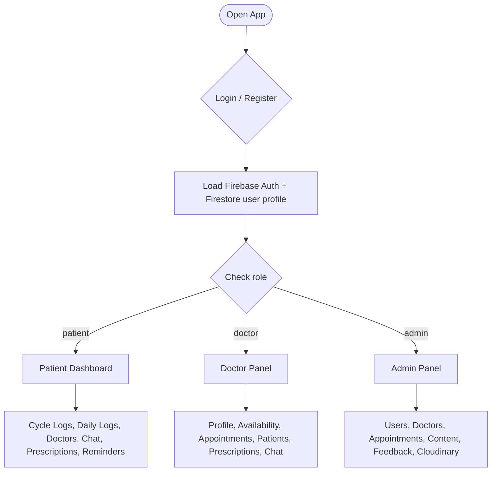
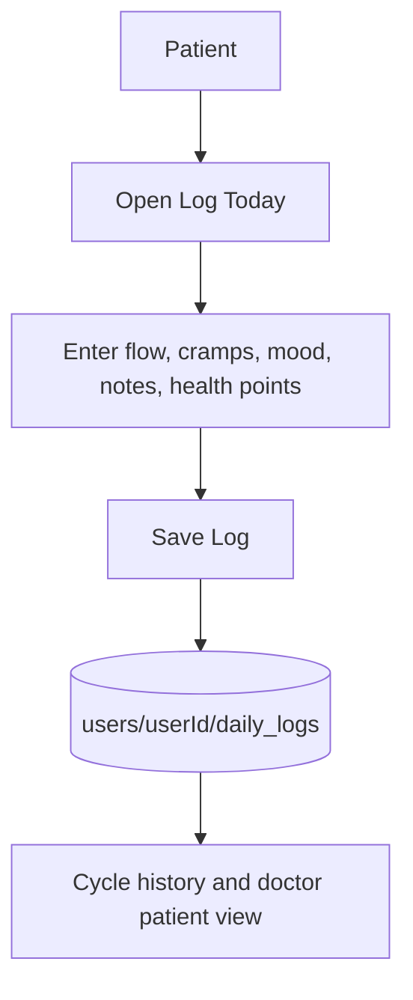
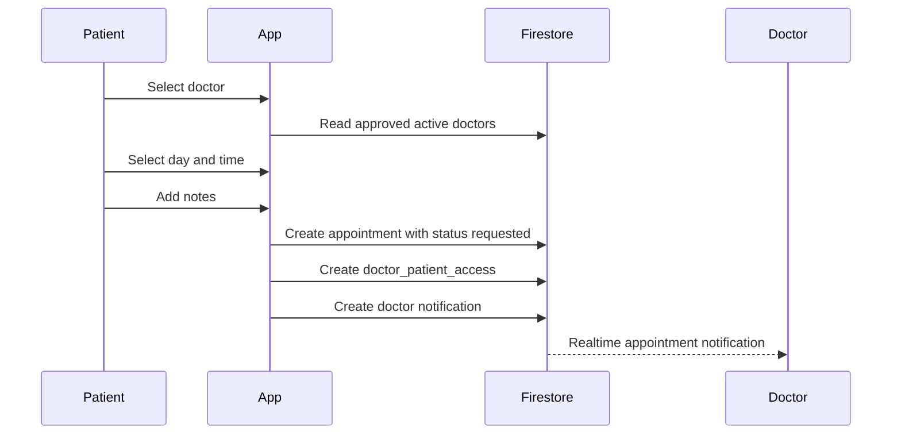
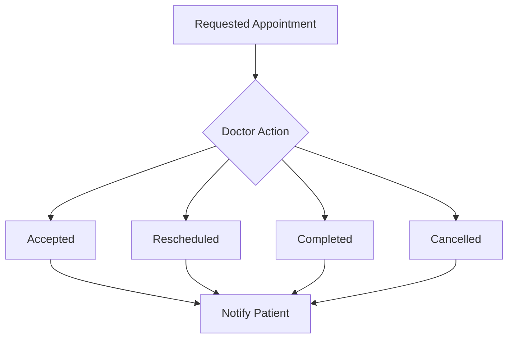

# Nisarga Role Flow README

This document explains the working app flow for the three main roles in Nisarga:
Patient, Doctor, and Admin. The app uses Firebase Authentication and Cloud Firestore for realtime data. Cloudinary is used for image uploads through an unsigned upload preset configured by admin.

## Role Summary

| Role | Main Purpose | Main Panel |
| --- | --- | --- |
| Patient | Track menstrual health, book doctors, chat, view prescriptions, manage reminders | User dashboard |
| Doctor | Manage profile, availability, appointments, patients, prescriptions, chat | Doctor Panel |
| Admin | Manage users, approve doctors, manage content, feedback, appointments, Cloudinary settings | Admin Panel |

## High Level Flow



## Patient Flow

### 1. Registration and Login

1. Patient registers using email and password.
2. Firebase Auth creates the login account.
3. Firestore creates a `users/{uid}` document with:
   - `role: patient`
   - `status: active`
4. Patient verifies email and logs in.
5. App loads the realtime Firestore user profile.

### 2. Home Dashboard

Patient dashboard provides:

- Cycle tracking
- Daily health log
- Doctor list
- Appointment booking
- Chat
- Prescriptions
- Reminders
- Notifications
- Articles, medicines, remedies, products, PCOD/PCOS content

### 3. Daily Log Flow



### 4. Doctor Booking Flow

1. Patient opens Doctors screen.
2. App loads only doctors where:
   - `status = approved`
   - `active = true`
3. Patient opens doctor detail page.
4. Patient selects available day and time from doctor availability.
5. Patient adds symptoms or notes.
6. Patient taps Book Appointment.
7. Appointment is saved in `appointments`.
8. Doctor receives realtime notification.
9. Doctor-patient access is created so doctor can view only linked patient data.



### 5. Patient Chat Flow

1. Patient opens chat from doctor card, doctor details, or appointment screen.
2. App creates or reuses a chat document.
3. Messages are stored in `chats/{chatId}/messages`.
4. Recipient gets a realtime notification.
5. If sending fails, the app shows an error and keeps the typed message.

### 6. Prescriptions Flow

1. Doctor saves prescription from patient detail screen.
2. Prescription is stored in `prescriptions`.
3. Patient receives notification.
4. Patient views prescriptions from the Prescriptions screen.

## Doctor Flow

### 1. Doctor Registration

1. Doctor registers using email and password.
2. Firebase Auth creates the login account.
3. Firestore creates:
   - `users/{uid}` with `role: doctor`, `status: pending`
   - `doctors/{doctorId}` with `status: pending`, `active: true`
4. Doctor verifies email.
5. Doctor waits for admin approval.

### 2. Doctor Approval Status

| Doctor Status | Doctor Panel Behavior | Patient Visibility |
| --- | --- | --- |
| pending | Can edit profile, cannot use full panel | Hidden |
| approved | Full doctor panel enabled | Visible |
| rejected | Can edit profile and contact admin | Hidden |
| disabled | Panel blocked | Hidden |

### 3. Doctor Profile and Timing Flow

Doctor can edit:

- Name
- Specialization
- Clinic
- Location
- Qualifications
- About
- Availability slots

Current availability format:

```text
Monday|10:00 AM
Tuesday|02:00 PM
Wednesday|11:30 AM
```

Allowed days:

```text
Monday, Tuesday, Wednesday, Thursday, Saturday
```

The patient booking screen displays these slots as clickable day and time buttons.

### 4. Doctor Appointment Flow

Doctor Panel -> Appointments tab:

- View realtime appointment requests.
- Accept appointment.
- Mark as rescheduled.
- Mark as completed.
- Cancel appointment.

Each status update:

1. Updates the appointment document.
2. Sends realtime notification to patient.
3. Keeps the patient linked to the doctor for patient-detail access.



### 5. Doctor Patients Flow

Doctor Panel -> Patients tab:

- Shows patients who have appointments with the doctor.
- Doctor can open patient details.
- Doctor can view:
  - Patient personal details
  - Contact
  - Age
  - Cycle information
  - Daily logs and symptoms
- Doctor can create prescription.
- Doctor can open patient chat.

Access is controlled through `doctor_patient_access`, so doctors do not see unrelated patients.

### 6. Doctor Chat Flow

1. Doctor opens chat from patient card.
2. Chat loads using patient ID and doctor ID.
3. Messages are realtime.
4. Patient receives notification for new messages.

## Admin Flow

### 1. Admin Login

Admin logs in with an account whose Firestore user profile has:

```text
role: admin
status: active
```

Only admin users can open the Admin Panel.

### 2. Users Tab

Admin can:

- View all users.
- Change user role:
  - patient
  - doctor
  - admin
- Change account status:
  - active
  - disabled

### 3. Doctors Tab

Admin can:

- View all doctors, including pending/rejected/disabled.
- Approve doctor.
- Reject doctor.
- Disable doctor.

Approval updates:

- `doctors/{doctorId}.status = approved`
- `doctors/{doctorId}.active = true`
- `users/{doctorUserId}.role = doctor`
- `users/{doctorUserId}.status = active`
- Doctor receives notification.

### 4. Appointments Tab

Admin can:

- View all appointments.
- Update appointment status:
  - accepted
  - rescheduled
  - completed
  - cancelled

### 5. Content Tab

Admin can manage:

- Articles
- Medicines
- Products
- Home remedies
- PCOD/PCOS exercises
- Cloudinary upload settings

Cloudinary settings required:

```text
Cloud name
Unsigned upload preset
Folder
```

Images are uploaded to Cloudinary from the app. Firestore stores only the image URL.

### 6. Feedback Tab

Admin can:

- View patient/user feedback.
- Mark feedback as read.
- Mark feedback as resolved.

## Realtime Notifications

Notifications are stored in:

```text
users/{userId}/notifications/{notificationId}
```

Triggered by:

- Appointment request
- Appointment status update
- Doctor approval/rejection/disable
- New chat message
- New prescription
- Voice/video request notification

## Main Firestore Collections

| Collection | Used By | Purpose |
| --- | --- | --- |
| `users` | Patient, Doctor, Admin | Role, status, profile |
| `doctors` | Doctor, Admin, Patient | Doctor profile and availability |
| `appointments` | Patient, Doctor, Admin | Booking and appointment status |
| `doctor_patient_access` | Doctor, Patient | Controls doctor access to patient health data |
| `chats` | Patient, Doctor | Realtime chat parent documents |
| `chats/{chatId}/messages` | Patient, Doctor | Chat messages |
| `prescriptions` | Patient, Doctor | Doctor-created prescriptions |
| `articles` | Patient, Admin | Health articles |
| `medicines` | Patient, Admin | Medicine guidance |
| `products` | Patient, Admin | Product suggestions |
| `home_remedies` | Patient, Admin | Home remedies |
| `exercises` | Patient, Admin | PCOD/PCOS exercises |
| `feedback` | Patient, Admin | User feedback |
| `settings/cloudinary` | Admin | Cloudinary upload config |

## Status Rules

### User Status

| Status | Meaning |
| --- | --- |
| active | User can use app |
| pending | Doctor account waiting for approval |
| rejected | Doctor profile rejected |
| disabled | Account blocked |

### Doctor Status

| Status | Meaning |
| --- | --- |
| pending | Doctor registered but not approved |
| approved | Doctor visible to patients |
| rejected | Doctor rejected by admin |
| disabled | Doctor hidden and blocked |

### Appointment Status

| Status | Meaning |
| --- | --- |
| requested | Patient requested appointment |
| accepted | Doctor accepted appointment |
| rescheduled | Doctor marked appointment for reschedule |
| completed | Appointment completed |
| cancelled | Appointment cancelled |

## Important Current Limitations

- Doctor reschedule currently updates status only. It does not yet open a day/time picker for new timing.
- Doctor availability editor is text based. A slot-picker UI can be added later.
- Voice and video buttons currently send request notifications only. Real call/video integration is not implemented.
- Cloudinary uploads require admin to save correct cloud name and unsigned preset first.
